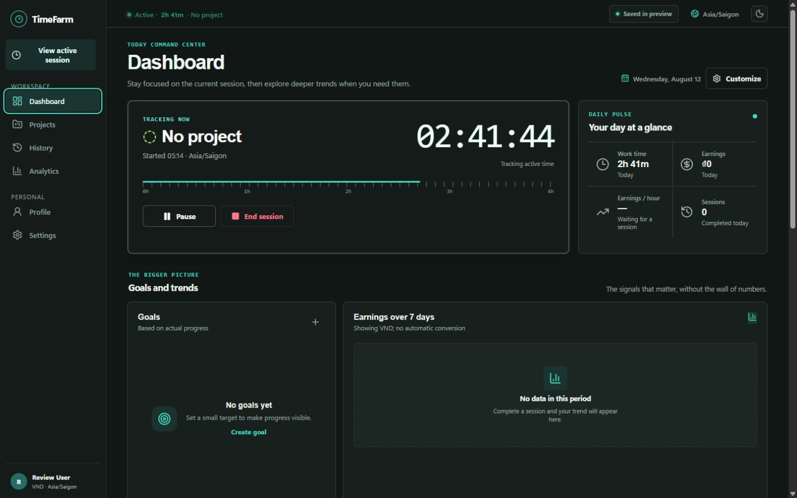
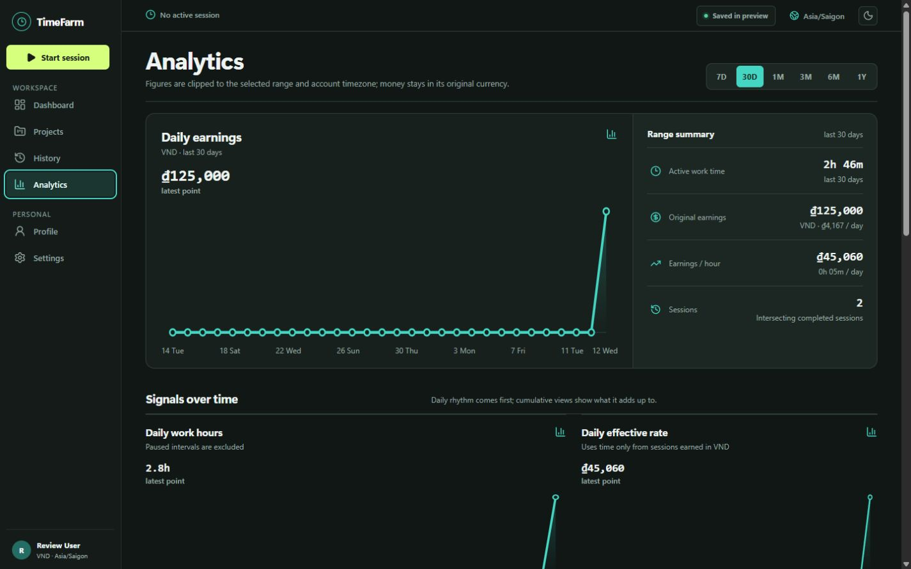

# TimeFarm — Offline-First Time Tracker & Earnings Analytics for Windows

<p align="center">
  
</p>

<p align="center">
  <strong>Track focused work. Record real earnings. Understand where your time goes.</strong><br />
  <sub>Ứng dụng theo dõi thời gian, quản lý dự án và phân tích thu nhập dành cho Windows.</sub>
</p>

<p align="center">
  <a href="https://github.com/qvinh8726/timefarm/actions/workflows/ci.yml"></a>
  <a href="https://github.com/qvinh8726/timefarm/releases"></a>
  
  
  <a href="LICENSE"></a>
</p>

<p align="center">
  <a href="https://github.com/qvinh8726/timefarm/releases/download/v0.2.2/TimeFarm-0.2.2-Setup.exe"><strong>Download TimeFarm v0.2.2 for Windows</strong></a>
  ·
  <a href="https://github.com/qvinh8726/timefarm/releases/tag/v0.2.2">Release notes</a>
  ·
  <a href="#quick-start-from-source">Run from source</a>
</p>

**TimeFarm** is an offline-first Windows time tracker, project timer, freelancer earnings tracker, and productivity analytics desktop app. It keeps work sessions in local SQLite storage, preserves earnings in their original currency, and turns completed work into clear project, goal, time, and income insights.

The timer and work history do not depend on an internet connection. The public v0.2.2 installer is an **unsigned, offline-only beta**: it does not bundle a Supabase project URL or public key, so cloud sign-in and synchronization are disabled in that binary. Developers can configure the optional Supabase path from source.

> **Before installing:** Windows SmartScreen may warn about the unsigned publisher. Verify `SHA256SUMS.txt` on the [v0.2.2 release page](https://github.com/qvinh8726/timefarm/releases/tag/v0.2.2), then continue only if the checksum matches.

## See TimeFarm in action

### A calm command center for the workday



### Time and earnings analytics without spreadsheet cleanup



## What’s new in v0.2.2

- **Quiet Instrument redesign:** a focused edge-to-edge Windows shell, measured timer display, open ledgers, restrained color, responsive light/dark themes, and a matching native mini timer.
- **Non-blocking timer and sync:** local timer commands commit without waiting for network work; cloud synchronization is coalesced separately and lease renewal remains independent.
- **Stronger history protection:** completed work and payment history cannot be lost through unsafe project deletion or concurrent record creation.
- **Money conservation:** daily and range allocation uses deterministic integer minor units, so distributed earnings add back to the exact recorded total.
- **Actionable conflict recovery:** **Keep local & retry** recreates a canonical outbox operation instead of merely dismissing the conflict.
- **Safer recovery and wipe:** legacy import exposes retry/export/skip outcomes; device wipe clears and verifies local state without falsely claiming cryptographic SSD erasure or cloud deletion.
- **Hardened optional sync contract:** Supabase migrations `0006` and `0007` add subject-bound RPC access, validation parity, optimistic revisions, bounded pagination, retention guards, deletion protection, and supporting indexes.
- **Desktop defense in depth:** strict navigation and IPC sender checks, denied renderer permissions and webviews, narrow context-isolated preload APIs, runtime public-key validation, and 9/9 Electron fuse checks.

See the complete history in [`CHANGELOG.md`](CHANGELOG.md) and the implementation evidence in [`docs/final-hardening-report.md`](docs/final-hardening-report.md).

## Why use TimeFarm?

| If you need to…                    | TimeFarm helps by…                                                                                                                 |
| ---------------------------------- | ---------------------------------------------------------------------------------------------------------------------------------- |
| Track billable or focused hours    | Persisting start times and pause intervals so refreshes and app restarts do not reset the clock.                                   |
| Understand freelance income        | Recording actual session earnings and payments without rewriting their original currencies.                                        |
| Review project performance         | Comparing active time, earnings, effective hourly rate, goals, and previous periods.                                               |
| Work without reliable internet     | Keeping the core workflow in local SQLite with WAL, transactions, recovery, and a durable sync outbox.                             |
| Keep a timer visible               | Providing a compact native mini timer with saved, clamped positioning.                                                             |
| Self-host optional synchronization | Including Supabase Auth, RLS, RPC, optimistic conflict handling, and ordered SQL migrations for operators to configure and verify. |

TimeFarm is especially suited to freelancers, consultants, independent creators, students, and anyone who wants a private Windows work-hours tracker with earnings analytics rather than a browser tab or mandatory SaaS account.

## Features

### Project timer and work history

- Start, pause, resume, complete, recover, or discard an unfinished session.
- Derive active duration from persisted timestamps while excluding pause intervals.
- Keep only one active timer and prevent work from starting on completed projects.
- Protect completed history from arbitrary changes; edit only the latest eligible session.
- Browse paginated history with projects, notes, earnings, currencies, and timestamps.

### Projects, payments, and goals

- Create color-coded projects with icons, statuses, payment models, and expected currencies.
- Keep session earnings separate from the project payment ledger.
- Block deletion when a project retains session or payment history.
- Set daily, weekly, and monthly time or earnings goals, plus completed-project goals.
- Review pace, remaining value, target progress, and projected completion.

### Dashboard and productivity analytics

- Reorder, resize, or hide dashboard widgets.
- Review the active timer, daily pulse, goals, earnings, project distribution, and comparisons.
- Explore 7-day through 1-year ranges with timezone-correct day boundaries.
- Count overlapping active intervals once in account time while preserving every source session and earning.
- Compare goal pace, project efficiency, duration distribution, prior periods, and data-backed observations.

### Earnings and currency integrity

- Store monetary values as safe integer minor units.
- Preserve VND, USD, EUR, JPY, and GBP as original historical facts.
- Calculate effective hourly rates only when earnings and time use compatible denominators.
- Fetch optional reference conversion from [Frankfurter](https://frankfurter.dev/) with timeouts and complete-rate validation.
- Show the reference date and stale-cache status instead of presenting old rates as current.

### Optional multi-device synchronization

When configured by an operator, the source includes:

- Authenticated Supabase email/password and Google OAuth entry points.
- Empty-device bootstrap before local onboarding can replace cloud history.
- Pull-before-push synchronization, durable outbox retries, and paginated remote reads.
- Per-entity optimistic revisions and explicit **Keep local** / **Use cloud** conflict choices.
- An online timer lease that reduces simultaneous starts across authenticated devices.

This capability is **not enabled in the downloadable v0.2.2 installer** and has not been validated against a hosted Supabase project for this release.

## Download and install on Windows

### Requirements

- Windows 10 or Windows 11, x64
- Permission to install a per-user desktop application

### Installation

1. Download [`TimeFarm-0.2.2-Setup.exe`](https://github.com/qvinh8726/timefarm/releases/download/v0.2.2/TimeFarm-0.2.2-Setup.exe) and [`SHA256SUMS.txt`](https://github.com/qvinh8726/timefarm/releases/download/v0.2.2/SHA256SUMS.txt).
2. Verify the installer checksum:

   ```powershell
   Get-FileHash .\TimeFarm-0.2.2-Setup.exe -Algorithm SHA256
   Get-Content .\SHA256SUMS.txt
   ```

3. Confirm that the two SHA-256 values match.
4. Run the installer. For this unsigned beta, SmartScreen may require **More info → Run anyway**.
5. Choose an installation directory, create a local profile, and start tracking.

## Quick start from source

### Requirements

- Windows 10/11 x64
- [Node.js](https://nodejs.org/) 24.x
- pnpm 11.x through Corepack
- Git

```powershell
git clone https://github.com/qvinh8726/timefarm.git
cd timefarm
corepack enable
pnpm install --frozen-lockfile
pnpm dev
```

`pnpm dev` starts Vite and Electron together. Use `pnpm dev:web` only for renderer UI work: browser preview does not exercise Electron SQLite, secure auth storage, IPC, native wipe, sync, or the mini timer.

## Architecture and technology

```text
React 19 + TypeScript + Vite renderer
                  |
                  | narrow, context-isolated IPC
                  v
Electron 43 main process
  |-- CommandService        validated intents; main-owned IDs and timestamps
  |-- LocalStateRepository  SQLite, WAL, migrations, recovery, durable outbox
  |-- SyncService           optional bootstrap, pull cursor, CAS, retry, conflicts
  |-- SupabaseAuthService   optional encrypted session and OAuth PKCE
  |-- TimerLeaseService     optional bounded cross-device lease
  |-- FxService             validated reference-rate cache
  `-- OverlayManager        native mini timer window
                  |
                  |-- local workly.db
                  `-- optional operator-configured Supabase Auth + RLS/RPC schema
```

The renderer cannot access Node.js, filesystem APIs, database credentials, or auth tokens. Electron enables context isolation and Chromium sandboxing, restricts navigation, rejects untrusted IPC senders, denies webviews and renderer permissions, and exposes only narrow preload operations.

Read [`ARCHITECTURE.md`](ARCHITECTURE.md) for runtime and persistence boundaries, [`PRIVACY.md`](PRIVACY.md) for data behavior, and [`SECURITY.md`](SECURITY.md) for vulnerability reporting.

## Privacy and security

- Projects, sessions, payments, goals, and preferences are stored in the current Windows user’s application-data directory.
- The repository does not include advertising or analytics telemetry.
- Core time tracking stays local; only an explicitly configured cloud workspace can synchronize eligible records.
- Supported auth material is encrypted through Electron secure storage and is never exposed to the renderer as bearer tokens.
- Reference-rate requests contain currency codes, not account IDs, project data, sessions, payments, or recorded amounts.
- **Wipe this device** clears and verifies known local app state. It does not cryptographically erase SSDs, snapshots, or backups, and it does not delete hosted Supabase rows or the Auth user.

## Optional Supabase setup

Supabase is not required for local time tracking. To develop or operate cloud sign-in and synchronization:

1. Create a Supabase project.
2. Apply every migration in order:
   - [`0001_workly_schema.sql`](supabase/migrations/0001_workly_schema.sql)
   - [`0002_bootstrap_snapshot.sql`](supabase/migrations/0002_bootstrap_snapshot.sql)
   - [`0003_atomic_workspace_claim.sql`](supabase/migrations/0003_atomic_workspace_claim.sql)
   - [`0004_paginated_bootstrap.sql`](supabase/migrations/0004_paginated_bootstrap.sql)
   - [`0005_optimistic_revisions.sql`](supabase/migrations/0005_optimistic_revisions.sql)
   - [`0006_production_hardening.sql`](supabase/migrations/0006_production_hardening.sql)
   - [`0007_sync_contract_and_retention.sql`](supabase/migrations/0007_sync_contract_and_retention.sql)
3. Enable Email Auth and, if needed, Google OAuth.
4. Add `timefarm://auth/callback**` to the accepted redirect patterns.
5. Set the project URL and publishable/anon client key in the terminal that launches or packages TimeFarm. `.env.example` documents the accepted names, but Electron does not automatically load `.env` files:

   ```dotenv
   TIMEFARM_SUPABASE_URL=https://your-project.supabase.co
   TIMEFARM_SUPABASE_ANON_KEY=your-publishable-or-anon-key
   ```

6. Validate the hosted contract with `pnpm check:cloud`, then test authentication, conflict handling, retention, and competing physical devices before distribution.

Never place a `service_role`, `sb_secret_*`, database password, personal access token, or other server credential in the desktop app. Cloud ownership is derived from `auth.uid()` and enforced by RLS and security-definer RPCs.

The repository includes a manual **Deploy Supabase migrations** workflow for an operator-controlled `production` environment. See [`supabase/RETENTION.md`](supabase/RETENTION.md) before enabling pruning.

## Development, testing, and packaging

Run the local source gates:

```powershell
pnpm format:check
pnpm lint
pnpm lint:css
pnpm check:electron
pnpm check:workflows
pnpm test
pnpm test:coverage
pnpm build
pnpm check:bundle
pnpm audit --prod --audit-level high
```

Database contract tests require a running local Supabase stack:

```powershell
supabase start
pnpm check:db
pnpm test:db
```

The release workstation could not run these commands because its local Supabase stack was unavailable. GitHub CI independently replayed migrations `0001` through `0007` on a fresh database, found no schema lint errors, and passed both pgTAP files (102 assertions). The hosted `pnpm check:cloud` check still could not run because no hosted URL or public key was supplied, so this is not presented as hosted Auth or multi-device verification.

Build an unpacked offline Windows application and run its smoke test:

```powershell
pnpm pack:win:dir
pnpm smoke:win:packaged
```

Build an offline NSIS installer without bundling cloud configuration:

```powershell
pnpm build
pnpm exec electron-builder --win nsis --x64 --publish never
pnpm check:win:fuses
pnpm smoke:win:installer
```

`pnpm pack:win` is reserved for a configured cloud build and validates the supplied public runtime configuration first. Artifacts are written to `release/`, which is excluded from Git.

## Beta limitations

TimeFarm v0.2.2 is a prerelease for local/offline-first evaluation:

- The Windows installer is not code-signed and may trigger SmartScreen.
- The release binary is x64 Windows-only and does not bundle Supabase configuration.
- Hosted migrations, RLS/RPC behavior, Email Auth, Google OAuth, and multi-device sync were not verified against a production Supabase project for this release.
- Clean-machine upgrade/rollback, long network faults, physical screen readers, multi-monitor/high-DPI behavior, crash/power-loss recovery, and SmartScreen reputation need broader real-device validation.
- There is no automatic update channel; follow [GitHub Releases](https://github.com/qvinh8726/timefarm/releases) for new builds.

## FAQ

### Does TimeFarm require an account or internet connection?

No. The v0.2.2 installer runs locally without an account. The timer, projects, history, goals, and analytics use SQLite. Internet access is needed only for optional reference exchange rates or a developer/operator-configured Supabase deployment.

### Why does Windows warn when I install it?

The v0.2.2 beta installer is unsigned. Verify its published SHA-256 checksum before choosing to run it. Code signing and SmartScreen reputation remain future release work.

### Does the downloaded installer synchronize devices?

No. It intentionally contains no Supabase URL or public key. The repository includes an optional synchronization implementation for developers and self-hosting operators, but this release binary is offline-only.

### Does TimeFarm convert or rewrite my earnings?

No. Recorded earnings remain in their original VND, USD, EUR, JPY, or GBP currency. Optional FX values are dated references for comparison only.

### Is this an open-source project?

No. The source is public for evaluation and contribution, but the project is **UNLICENSED / all rights reserved**. The repository does not grant permission to copy, modify, redistribute, sublicense, sell, or use the software without prior written permission. See [`LICENSE`](LICENSE).

### Where should I report a bug or security issue?

Use [GitHub Issues](https://github.com/qvinh8726/timefarm/issues) for reproducible, non-sensitive bugs. Follow [`SECURITY.md`](SECURITY.md) for vulnerabilities, and never publish credentials, private work history, payment data, or an unredacted database.

## Documentation

- [`ARCHITECTURE.md`](ARCHITECTURE.md) — runtime, persistence, sync, and security boundaries
- [`CHANGELOG.md`](CHANGELOG.md) — release history
- [`PRIVACY.md`](PRIVACY.md) — local and optional cloud data behavior
- [`SECURITY.md`](SECURITY.md) — responsible vulnerability reporting
- [`SUPPORT.md`](SUPPORT.md) — supported beta workflows
- [`design-system/timefarm/MASTER.md`](design-system/timefarm/MASTER.md) — UI tokens, hierarchy, responsiveness, and accessibility
- [`docs/final-hardening-report.md`](docs/final-hardening-report.md) — v0.2.2 hardening evidence and remaining risks

## License

Copyright © 2026 TimeFarm contributors. This repository is **source-available and UNLICENSED / all rights reserved**. See [`LICENSE`](LICENSE) before copying, modifying, redistributing, or using the source.
